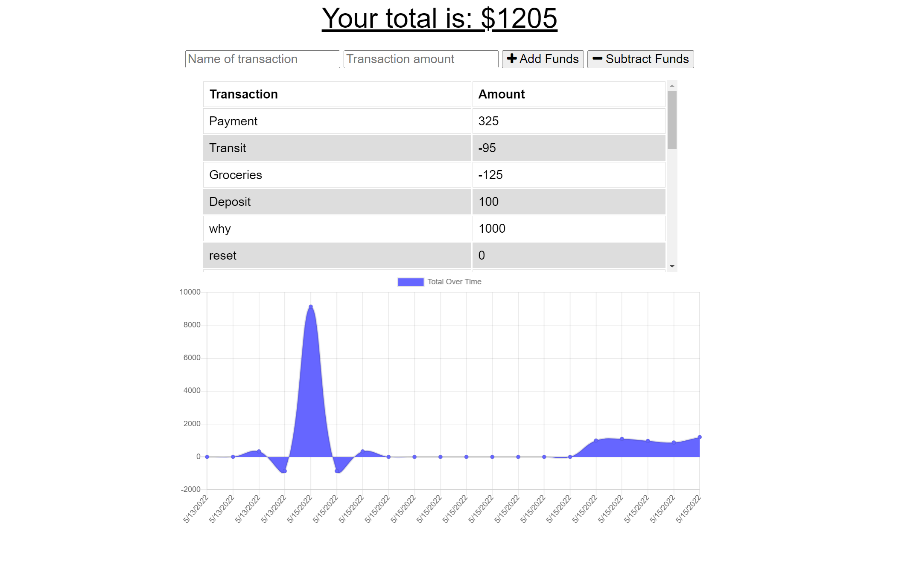

# PWA-Budget-Tracker

For this assignment, the task was to create a budget tracking application that would be able to function and continue to do so with its existing history offline. When entering transactions, whether the app is online or offline, the data will populate the total.

## Table of Contents
- [Installation](#Installation)
- [Usage](#Usage)
- [Demo](#Demo)

# Installation 

Required packages:
- Express
- Mongoose
- MongoDB
- Node
- Compression
- Morgan

Clone the repo into a directory of your choice, and run npm install in said directory.

Open a terminal in the root folder of the PWA-Budget-Tracker, and run ``` mongod ```

Once running, open another terminal in the same folder, and run ``` node server ```

Depending on the localhost of your choice, (located in server.js, the default will be 3001) go into a browser of your choice and enter in the url ``` localhost:3001 ```

# Usage

In order to make the app maintain functionality offline, the project needed a ``` manifest.json ``` file and a ``` service-worker.js ``` file.

The manifest.json file is a JSON that provides the app with things such as the name, icons it uses, etc. (essentially everything the browser would cache except now offline)

The service-worker.js file works to cache everything manually, and provides functionality for install, activate, and fetch.

The app itself simply has an input box, alongside an Add(+) and Subtract(-) button which will reflect on the overall budget. Below is a graph which reflects the movement of the budget over the timespan of using said app.

# Demo
Heroku Link: https://sonny-pwa-budget-tracker.herokuapp.com/

Appearance of site:


Github: https://github.com/sonnytedesco26/PWA-Budget-Tracker